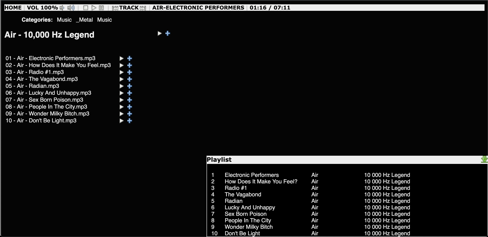

# Pickup

This is pickup, a web-based music player.

Pickup is my white whale... I've been playing with the idea since 2007. I have a
large music collection, and my navigation of choice is by album, with easy
search available. The "albums" interface in old Google Play Music (web) was pretty
close, but the uploaded never worked for me and now the product is dead.

## Status

There's a functioning, but abandoned, Go and React version in [go/](./go/README.md) that works as a frontend to [Music Player Daemon](http://mpd.wikia.com/wiki/Music_Player_Daemon_Wiki).
It works, more or less. You can add albums and tracks to the playlist, control
volume, skip tracks, start/stop playback. You can view the playlist. It runs on
the Raspberry Pi with room to run mpd as well. Because of the client-side
architecture it is very fast.

In mid-2021, I started rewriting the backend in Rust. The two motiviations for this are:

- This is the project I usually use to learn a new language or framework
- I want to get away from mpd and have a single executable that can do the web part, plus control the playlist and actually play music, and set us up for playback in the browser. This is basically a complete rewrite anyway.

## Background

I've written functional prototypes of this in C++, Python, C++ again (I was
trying to run it on an NSLU2 embedded Linux machine with 32MB RAM) and now Go.
It started off as a standalone player, then grew an xmms2 backend, and now is
going to use mpd for playback, since I already use mpd everywhere and it just
works. I'm writing it now in Go because I want to learn Go and I want to have
this system. This is my first real project in go: any code review, criticism or
contributions would be much appreciated.

## Design Requirements

- Run on embedded hardware - any tiny board that runs Linux would be nice, Raspberry
  Pi would be fine.
- Display results quickly even when the music is stored on a slow-ish network
  drive (i.e. some caching of available music).
- Include more metadata than pure MPD, e.g. related artists, reviews etc. Can be
  loaded on the fly or stored locally.
- Show random albums to play. Shuffle-by-album.
- Assume /some/netsted/path/Artist/Album/Track.extension file format
- Must have: play now / add to main playlist
- Must have: play internet streams (e.g. DI Radio)
- Must have: responsive frontend, single-page-app feel.

## Design Approach

#### Go Version:

- The Go implementation is a simple backend serving JSON to a React frontend, and requires MPD
  for actually indexing and playing music.
- The simple React frontend loads the entire music collection up front. This takes less than
  a second and makes navigating around the collection extremely fast.

#### Rust Version:

- Built-in music player in the server and file indexing, so no need for MPD.
- I intend to add in-browser music playback as well.
- There's no frontend yet but I will either port the Go version to Typescript and React or write a new one in Svelte.

## Screenshot

